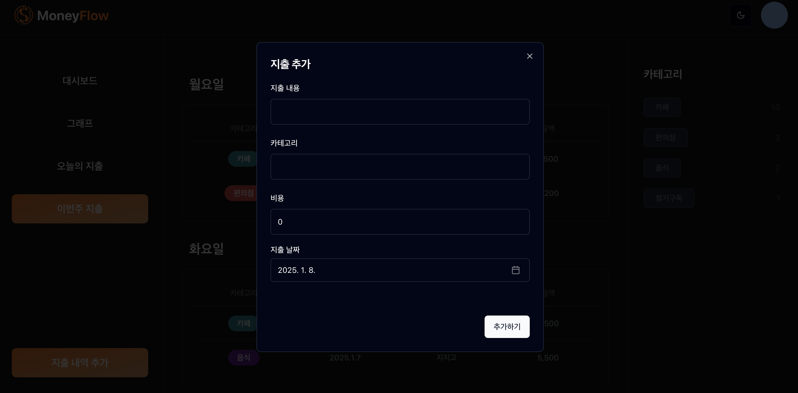

# MoneyFlow

## 프로젝트 진행 동기

- 지인이 엑셀로 가계부를 작성하는 과정에서 어려움을 겪는 모습을 보고, 비슷한 어려움을 겪는 사람들이 많을 것이라 판단해 해당 서비스를 기획했습니다.
- Bear 메모 앱의 태그 기반 분류 시스템에서 영감을 받아, 카테고리를 활용해 지출 내역을 체계적으로 관리할 수 있는 가계부를 설계했습니다.

## 스택

- Next.js
- Tailwind CSS
- TypeScrupt
- Prisma
- PostgreSQL

## 주요기능

> 라이트 모드의 화면은 코드/images/light 폴더에 있습니다.

### 로그인 및 회원가입 화면

---

### 대시보드

전체적인 지출내역을 보여주는 페이지입니다. 목표 원형 그래프를 통하여 돈관리에 대해 목표의식을 가지고 시각적으로 관리할 수 있도록 하기 위해 노력했습니다.

---

### 그래프 뷰

1주일, 1달, 3달치의 지출 내역을 그래프를 통하여 시각적으로 보여주기 위해 노력하였습니다.

---

### 오늘의 지출

오늘 날짜에 해당하는 지출 내역을 보여주는 화면입니다.

---

### 이번주 지출

이번주 동안 발생한 지출 내역을 요일별로 보여주는 화면입니다.

---

### 카테고리별 지출 내역

카테고리별로 해당 카테고리를 가진 지출내역을 보여주는 화면입니다.

---

### 지출 내역 추가 화면

지출 내역을 추가하는 화면입니다.

---

### 카테고리 수정 및 삭제 화면

카테고리 수정 및 삭제화면입니다. 수정화면에서는 카테고리 이름 변경 및 카테고리 배경색상 변경 기능이 존재하며, 삭제의 경우 해당 카테고리를 포함한 지출내역도 함께 삭제된다는 확인 메세지를 보여줍니다.

---

### 목표 추가 화면

대시보드화면에 들어가는 목표를 추가하는 폼입니다.

---

### 모바일 화면

모바일 화면의 경우 우측 및 좌측의 사이드바를 표시하기 어려워 유저 드롭다운 메뉴에 각각의 뷰로 가는 링크 및 카테고리 항목들을 포함시켰습니다.
